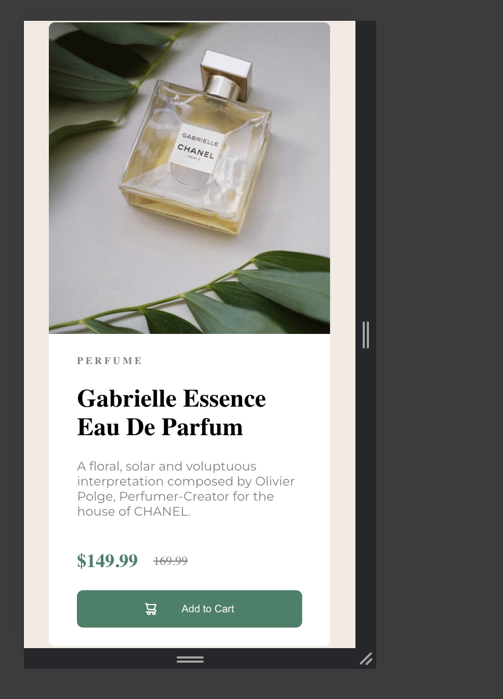

# Frontend Mentor - Product preview card component solution

This is a solution to the [Product preview card component challenge on Frontend Mentor](https://www.frontendmentor.io/challenges/product-preview-card-component-GO7UmttRfa). Frontend Mentor challenges help you improve your coding skills by building realistic projects. 

## Table of contents

- [Overview](#overview)
  - [The challenge](#the-challenge)
  - [Screenshot](#screenshot)
  - [Links](#links)
- [My process](#my-process)
  - [Built with](#built-with)
  - [What I learned](#what-i-learned)
  - [Continued development](#continued-development)
  - [Useful resources](#useful-resources)
- [Author](#author)
- [Acknowledgments](#acknowledgments)

**Note: Delete this note and update the table of contents based on what sections you keep.**

## Overview

### The challenge

Users should be able to:

- View the optimal layout depending on their device's screen size
- See hover and focus states for interactive elements

###     




### Links

- Solution URL: [Github Link](https://github.com/tflinch/Product-Review)
- Live Site URL: [Pending](https://your-live-site-url.com)

## My process
I decided I wanted to challenge myself with using React and React Components for this challenge. 
  - I broke each step down by creating my react app:
  1. Initial project structure and files
  2. Markdown all neccessary HTML
  3. Downloaded fonts and applied basic styling
  4. Advance HTML Markdown

### Built with

- Semantic HTML5 markup
- CSS custom properties
- Flex
- Mobile-first workflow
- [React](https://reactjs.org/) - JS library

### What I learned

I learned how to properly load fonts as well as difference for src/ass and public paths: Also applying styles to my index.css was fun instead of creating styling for each seperate component. I also tried to implement defualt resopnsive capabilites thru css and by not using any hard coded values like pixels in my css.

```css

@media (max-width: 500px) {
  .container {
    display: flex;
    flex-direction: column;
    height: 50rem;
    margin: 2rem;
    
  }

  .img-container {
    height: 50%;
  }

  .img-container img {
    height: 100%;
    object-fit: cover;
    border-radius: .5rem .5rem 0 0;
  }
}
```
```js
function App() {

  return (
      <div className='container'>
        <Image />
        <Content/>
      </div>
  )
}

```